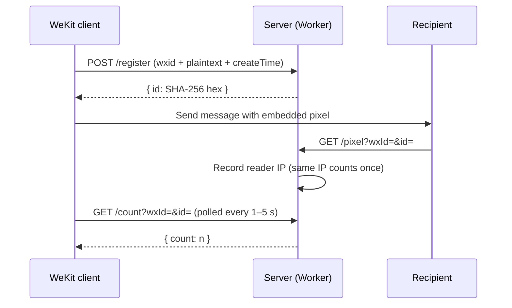

# Read Receipts Server

English | [简体中文](README.md)

[](LICENSE)
[](https://workers.cloudflare.com)
[](https://developers.cloudflare.com/d1/)

A message read-count tracking service built on **Cloudflare Workers + D1**. Embed a 1x1 transparent tracking pixel in your messages — when recipients open the message, their IP is recorded and deduplicated read counts are returned. Includes a dark-themed dashboard, per-user data isolation, and an admin backend.

> [!WARNING]
> **Privacy disclosure**: This service records recipients' IP addresses and exact open timestamps without their knowledge. In China this falls under the Personal Information Protection Law (PIPL) — inform recipients before tracking, and consider data minimization (wipe data in the admin console when done). WeChat's terms of service prohibit third-party tracking of this kind; your account may be at risk.

## Quick Start

See the [Deployment](#deployment) section and pick one of the two options. Once deployed, visit your Worker domain and register an account to start; for invite codes or admins, see [Environment Variables](#environment-variables).

> [!IMPORTANT]
> Run `schema.sql` once after the first deploy, otherwise every endpoint fails with missing-table errors. It is idempotent — re-run it when upgrading.

## How It Works



## Features

- **Multi-user isolation** — wxid is the account, password login, each user sees only their own messages
- **Level quotas** — level N keeps N messages for N months (max 99); level 0 = blocked and wipes the account's data immediately
- **Invite codes & admins** — optional `INVITE_CODE` gates registration; `ADMIN` accounts can access `/admin` to manage users and data
- **Deterministic IDs** — Message ID = `SHA256(wxId + \0 + content + \0 + createTime)`, computed independently by client and server with identical results
- **IP deduplication** — the same IP opening multiple times counts as 1 read, enforced at the storage level via a unique index
- **Dashboard** — dark-themed, responsive UI with EN/中文 i18n, search, filtering, expandable read details, password change
- **Messages leaderboard** — shows a leaderboard of registered-message counts on the dashboard, switchable between daily and overall; counts are cumulative "messages ever registered" and are unaffected by level-quota cleanup; top 10 only, wxids masked server-side (full account never reaches the frontend), your own row highlighted; the daily ranking is based on the China timezone (UTC+8) day boundary
- **Serverless, zero cost** — runs on the Cloudflare Workers edge network; within the free tier: 100k requests/day, 5GB D1 reads/day

## Client Integration

This service is also called by the WeKit client module (third-party, not modifiable), which uses the following three **unauthenticated** endpoints, relying only on the precondition that "wxid is a registered account":

| Endpoint | Purpose |
|----------|---------|
| `POST /register` | Submit the message plaintext (wxid + content + createTime) when sending |
| `GET /count` | Poll once every 1–5 seconds for each message currently on screen |
| `GET /pixel` | Loaded when a recipient opens the message |

Please be aware:

- **The invite code only gates account registration** (`/auth/register`), not message registration. Anyone who knows a user's wxid can register messages on their behalf (throttled to 30 req/min per IP)
- The level quota uses lazy cleanup that **deletes the oldest messages when over quota**, triggered when registering a new message or viewing messages/counts: registering N+1 messages against a wxid triggers deletion of all its messages (N ≤ 99). Use this only within a trusted circle, and use `ADMIN` to manage accounts
- The server receives message plaintext (needed to match read records) — this is inherent to the design

## Accounts & Levels

- **Registration**: visit the login page → switch to "Register" → enter wxid + password (≥8 chars) + invite code → auto-login
- **Login**: wxid + password → POST to `/auth/verify` → sets an `__Host-session` cookie (HttpOnly, Secure, SameSite=Lax, 30 days) → redirects to `/`. Admins must manually visit `/admin` to access the backend
- **Sessions**: the server stores only a SHA-256 hash of a random session ID; the cookie never contains the password
- **Data isolation**: all `/messages*`, `/reads/*` endpoints are scoped to the currently logged-in account's wxid; `/count` and `/register` are public endpoints that address the account via the `wxId` parameter (see [Client Integration](#client-integration))

### Level Quotas

New users are **level 1**. Level N means: keep up to **N messages**, each for up to **N months** (max 99). When registering a new message or viewing messages, the oldest message beyond the quota is auto-deleted, and messages older than N months are purged (lazy cleanup). **Level 0 = blocked**: cannot register messages, and setting a user to level 0 immediately wipes all their messages and reads (the account is kept and can be re-promoted at any time). Admins can adjust levels (0–99) in the backend.

## API Reference

> [!NOTE]
> Param names follow the client's convention: `wxId` (the account format is `wxid_xxx`). Endpoints without a noted auth requirement require a login.

### Public endpoints (no login)

| Method | Path | Description |
|--------|------|-------------|
| POST | `/register` | Register a message (wxid must be a registered account), returns `{id}` |
| GET | `/pixel?wxId=&id=` | Tracking pixel (1x1 PNG), records reader IP (only for registered messages) |
| GET | `/count?wxId=&id=` | Deduplicated read count for a message |
| POST | `/auth/register` | Register an account (wxid + password + invite code) |
| POST | `/auth/verify` | wxid + password login, sets session cookie |
| GET | `/auth/status` | Returns `{auth_required, invite_required}` |

### Authed endpoints (session cookie)

| Method | Path | Description |
|--------|------|-------------|
| GET | `/` | Dashboard frontend (redirects to login if unauthenticated) |
| GET | `/messages?q=` | List all own messages with read counts |
| DELETE | `/messages` | Delete all own messages (audited) |
| GET | `/messages/{wxId}?q=` | List messages by sender (own only) |
| DELETE | `/messages/{wxId}` | Delete all messages from a sender (own only, audited) |
| GET | `/reads/{id}` | Get detailed read records for an own message |
| GET | `/leaderboard?scope=day\|total` | Leaderboard of registered-message counts (cumulative, top 10, wxids masked, `me` flag marks yourself; daily scope uses the China timezone) |
| POST | `/auth/logout` | Destroy current session |
| POST | `/auth/password` | Change own password |

### Admin endpoints (ADMIN accounts only)

| Method | Path | Description |
|--------|------|-------------|
| GET | `/admin` | Admin backend |
| GET | `/admin/users` | List all users |
| POST | `/admin/level` | Adjust a user's level (0–99) |
| POST | `/admin/password` | Set a new password for any user |
| DELETE | `/admin/users/{wxId}` | Delete a user and all their data |
| GET | `/admin/messages` | Browse all messages (filterable by wxId / content) |
| DELETE | `/admin/messages?wxId=` | Delete all data for a user |
| DELETE | `/admin/messages/{id}` | Delete a single message |

## Environment Variables

| Variable | Required | Description |
|----------|----------|-------------|
| `INVITE_CODE` | No | Invite code. When set, registration requires it; when empty, registration is open |
| `ADMIN` | No | Comma-separated wxid list; these accounts can access the `/admin` backend. When unset, there are no admins |

```bash
npx wrangler secret put INVITE_CODE   # optional
npx wrangler secret put ADMIN         # optional, e.g.: wxid_a,wxid_b
```

> [!IMPORTANT]
> Set both `INVITE_CODE` and `ADMIN` as **Secrets**, not plaintext variables. When deploying via Workers Builds (Git integration), every build syncs configuration from the `wrangler.toml` in the repo, deleting plaintext variables that only exist in the dashboard. Secrets are managed independently by the platform and are never touched by builds.

## Deployment

Neither option requires a D1 database ID: the database is auto-created and bound on the first deploy (Automatic provisioning, requires Wrangler ≥ 4.45.0; the ID stays in the dashboard, never in the repo).

### CLI

```bash
git clone https://github.com/lie-jiu/wekit-read-receipts-cf-workers
cd wekit-read-receipts-cf-workers
npx wrangler login
npx wrangler deploy                  # auto-creates the D1 database on first deploy
npx wrangler d1 execute read-receipts --file=./schema.sql --remote
```

### Workers Builds (Git integration)

1. Fork this repository (or use your own)
2. Cloudflare Dashboard → **Workers & Pages → Create → Worker** → choose **Workers Builds**
3. **Connect to GitHub**, select your repository; production branch `main`, build command empty
4. `git push` to `main` auto-builds and deploys; the D1 database is auto-created on the first deploy
5. Run `schema.sql` once in the D1 database console

> [!IMPORTANT]
> Workers Builds treats the repo's `wrangler.toml` as the single source of truth: plaintext variables configured in the dashboard are overwritten/removed on every build. Store `INVITE_CODE` and `ADMIN` as Secrets instead.

### Upgrading an existing deployment

Re-run `schema.sql` once. It is idempotent and will:

- create the `users`, `sessions`, and `audit_logs` tables
- create the `registration_stats` table (leaderboard source) and backfill registration counts for existing messages using the China timezone
- deduplicate existing `reads` rows and add the unique `(id, ip)` index
- add the `reads(wx_id, timestamp)` index to avoid full-table scans on `/count` polling
- (existing readers who already re-opened a message keep their first record only)

> [!NOTE]
> Re-running `schema.sql` truncates the `sessions` table (all users must log in again once).

### Wiping data

> [!IMPORTANT]
> To wipe all data, run `DELETE FROM messages; DELETE FROM reads; DELETE FROM users; DELETE FROM sessions; DELETE FROM audit_logs;` (or delete tables individually). **Do not delete the D1 database itself.** Deleting it assigns a new database ID, so the worker binding points to a database that no longer exists (the binding shows "Not Found" when opened).

## Security Design

- **Rate limiting** — `/pixel`: 10 req/min per IP; `/register` (messages): 30 req/min per IP (fail-open, does not break the client); `/auth/verify`, `/auth/register`, `/auth/password`: 5 req/min per IP (fail-closed)
- **Password hashing** — PBKDF2-SHA256, per-user random salt, 100k iterations (Web Crypto, natively available in Workers)
- **Registered-message check** — `/pixel` ignores reads for unregistered messages (blocks DB-filling attacks)
- **Storage-level dedup** — unique index on `reads(id, ip)` + `INSERT OR IGNORE`
- **Constant-time password comparison** — via SHA-256 digests; failed logins add randomized delay
- **Session cookies** — random id, hash-at-rest, 30-day expiry, `__Host-` prefix, Secure/HttpOnly/SameSite=Lax
- **Trusted client IP only** — reads `CF-Connecting-IP`; client-controlled headers are ignored
- **Security headers** — CSP, `X-Content-Type-Options`, `X-Frame-Options`, `Referrer-Policy` on all responses
- **Input validation** — length limits on register fields, LIKE-wildcard escaping, malformed-URL handling, wxid format validation
- **Audit log** — every bulk/sender delete is recorded in the `audit_logs` table (auto-purged after 30 days)

## Project Structure

```
├── schema.sql          # D1 table definitions + idempotent migration
├── src/
│   ├── index.js        # Worker entry: routing + scheduled tasks (fetch / scheduled)
│   ├── auth.js         # Session parsing, cookies, admin checks, level quotas
│   ├── config.js       # Constants, security headers / CSP config
│   ├── utils.js        # Utilities: password hashing, rate limiting, audit, responses
│   ├── png.js          # Tracking pixel (1×1 PNG)
│   └── pages/          # Frontend page templates (login / dashboard / admin)
│       ├── login.js
│       ├── dashboard.js
│       └── admin.js
├── wrangler.toml       # Cloudflare Workers config (D1 binding + cron)
├── package.json
└── LICENSE
```

## Tech Stack

- **Runtime:** Cloudflare Workers (V8 isolates, global edge network)
- **Database:** Cloudflare D1 (SQLite-compatible)
- **Frontend:** Vanilla HTML/CSS/JS, no build step, no dependencies
- **Hashing:** Web Crypto API (SHA-256)
- **Rate limiting:** Workers Cache API (fixed window)

## License

Apache-2.0
