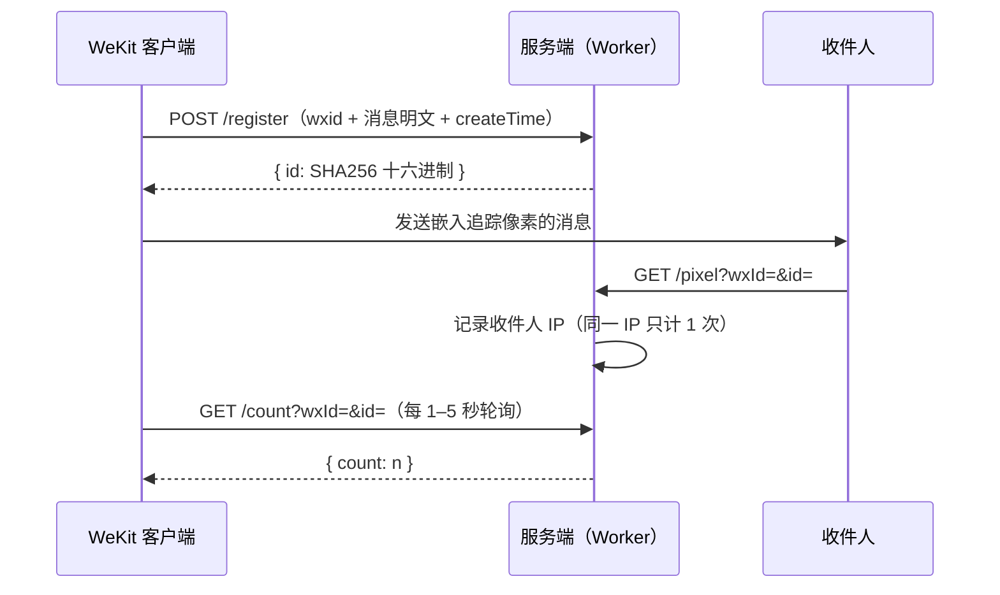

# Read Receipts Server

[English](README.en.md) | 简体中文

[](LICENSE)
[](https://workers.cloudflare.com)
[](https://developers.cloudflare.com/d1/)

基于 **Cloudflare Workers + D1** 的消息已读统计服务。在消息中嵌入一个 1×1 透明追踪像素，收件人打开消息时服务记录其 IP，并返回去重后的已读次数。带深色主题仪表盘、多用户数据隔离与管理员后台。

> [!WARNING]
> **隐私提示**：本服务会在对方不知情的情况下记录收件人的 IP 地址与精确打开时间。在中国，这属于《个人信息保护法》（PIPL）的管辖范围——追踪前请告知收件人，并考虑数据最小化（用完后请在后台清空数据）。微信服务条款禁止此类第三方追踪，你的账号可能面临风险。

## 快速开始

部署与初始化方式见[部署](#部署)章节，两种方式任选其一。部署完成后访问你的 Worker 域名，注册账号即可使用；如需邀请码或管理员，见[环境变量](#环境变量)。

> [!IMPORTANT]
> `schema.sql` 必须在首次部署后执行一次，否则所有接口都会因缺少数据表而报错。它是幂等的，升级时重跑即可。

## 工作原理



## 功能特性

- **多用户隔离** — wxid 即账号，密码登录，每个用户只能看到自己的消息
- **等级配额** — 等级 N 保留 N 条消息 × N 个月（最大 99）；等级 0 = 拉黑，立即清空该账号数据
- **邀请码与管理员** — 可选 `INVITE_CODE` 限制注册；`ADMIN` 账号可访问 `/admin` 管理用户与数据
- **确定性 ID** — 消息 ID = `SHA256(wxId + \0 + content + \0 + createTime)`，客户端与服务端独立计算结果一致
- **IP 去重** — 同一 IP 多次打开只计 1 次已读，由存储层唯一索引强制执行
- **仪表盘** — 深色主题、响应式界面，支持中英文 i18n、搜索、筛选、已读详情展开、修改密码
- **排行榜** — 仪表盘展示三张榜（注册榜 / 已读榜 / 消息榜），均可切换日榜/总榜；统计的是「累计发生过」的数据（注册消息数、收到的已读次数、单条消息的已读次数），不受等级配额清理影响；仅显示前十，wxid 在服务端脱敏（完整账号不暴露到前端），消息榜内容同样脱敏（仅显示首尾各 2 字，不足 5 字全文显示），本人（或本人的消息）上榜高亮；日榜按中国时区（UTC+8）自然日划分
- **Serverless 零成本** — 运行于 Cloudflare Workers 边缘网络，免费额度内每天 10 万次请求、D1 每天 5GB 读取

## 客户端接入

本服务被 WeKit 客户端模块（第三方，不可修改）调用，它直接使用下面三个**无鉴权**端点，仅依赖「wxid 已是已注册账号」这一前置条件：

| 端点 | 用途 |
|------|------|
| `POST /register` | 发送消息时提交消息明文（wxid + content + createTime） |
| `GET /count` | 对屏幕上的每条消息每 1–5 秒轮询一次 |
| `GET /pixel` | 收件人打开消息时加载 |

请知悉：

- **邀请码只限制账号注册**（`/auth/register`），不参与消息注册。任何知道某用户 wxid 的人都能冒充该账号注册消息（受每 IP 每分钟 30 次的限流约束）
- 等级配额采用「超额删除最旧消息」的惰性清理：注册新消息或查看消息/已读次数时触发，向某 wxid 连续注册 N+1 条消息即可触发其全部消息被清除（N ≤ 99）。请仅在受信任的小圈子中使用，并善用 `ADMIN` 管理账号
- 服务端会收到消息明文（用于匹配已读记录），这是该方案的本质

## 账户与等级

- **注册**：首次使用访问登录页 → 切换到「注册」→ 填写 wxid + 密码（≥8 位）+ 邀请码 → 自动登录。也可以由管理员在 `/admin` 后台直接创建账号（wxid + 密码，默认等级 1，仅校验不重复）
- **登录**：wxid + 密码 → POST 到 `/auth/verify` → 设置 `__Host-session` cookie（HttpOnly、Secure、SameSite=Lax，30 天）→ 重定向到 `/`。管理员需手动访问 `/admin` 进入后台
- **会话**：服务端只存储会话 ID 的 SHA-256 哈希，cookie 本身从不包含密码
- **数据隔离**：所有 `/messages*`、`/reads/*` 端点强制限定为当前登录账号的 wxid；`/count`、`/register` 为公开端点，通过请求中的 wxId 参数指定账号（见[客户端接入](#客户端接入)）

### 等级配额

新注册用户为**等级 1**。等级 N 表示：最多保留 **N 条消息**，每条最多保留 **N 个月**（N 最大 99）。注册新消息或查看消息时，超出配额的最早消息自动删除，超过 N 个月的旧消息一并清理（惰性执行）。**等级 0 = 拉黑**：禁止注册消息，且管理员将其设为 0 时立即清空该账号的全部消息与已读记录（账号保留，可随时改回）。管理员可在后台调整用户等级（0–99）。

## API 参考

> [!NOTE]
> 参数名沿用客户端约定的 `wxId`（账号格式为 `wxid_xxx`）。未注明鉴权的端点均需登录。

### 公开端点（无需登录）

| 方法 | 路径 | 说明 |
|------|------|------|
| POST | `/register` | 注册消息（wxid 必须是已注册账号），返回 `{id}` |
| GET | `/pixel?wxId=&id=` | 追踪像素（1×1 PNG），记录读者 IP（仅对已注册消息生效） |
| GET | `/count?wxId=&id=` | 消息的去重已读次数 |
| POST | `/auth/register` | 注册账号（wxid + 密码 + 邀请码） |
| POST | `/auth/verify` | wxid + 密码登录，设置会话 cookie |
| GET | `/auth/status` | 返回 `{auth_required, invite_required}` |

### 登录端点（会话 Cookie）

| 方法 | 路径 | 说明 |
|------|------|------|
| GET | `/` | 仪表盘前端（未登录跳转登录页） |
| GET | `/messages?q=` | 本人的全部消息及其已读次数 |
| DELETE | `/messages` | 删除本人的全部消息（记录审计日志） |
| GET | `/messages/{wxId}?q=` | 按发送者列出消息（仅限本人） |
| DELETE | `/messages/{wxId}` | 删除某发送者的全部消息（仅限本人，记录审计日志） |
| GET | `/reads/{id}` | 本人某条消息的详细已读记录 |
| GET | `/leaderboard?scope=day\|total&metric=reg\|read\|msg` | 排行榜：`reg` 注册榜 / `read` 已读榜 / `msg` 单条消息已读榜（累计数据，前十，wxid 脱敏，`me` 标记本人；日榜按中国时区） |
| POST | `/auth/logout` | 销毁当前会话 |
| POST | `/auth/password` | 修改自己的密码 |

### 管理员端点（仅 `ADMIN` 账号）

| 方法 | 路径 | 说明 |
|------|------|------|
| GET | `/admin` | 管理后台 |
| GET | `/admin/users` | 列出所有用户 |
| POST | `/admin/users` | 创建新用户（wxId + 密码，默认等级 1，仅校验不重复） |
| POST | `/admin/level` | 调整用户等级（0–99） |
| POST | `/admin/password` | 为任意用户设置新密码 |
| DELETE | `/admin/users/{wxId}` | 删除用户及其全部数据 |
| GET | `/admin/messages` | 全量消息浏览（可按 wxId / 内容过滤） |
| DELETE | `/admin/messages?wxId=` | 删除某用户的全部数据 |
| DELETE | `/admin/messages/{id}` | 删除单条消息 |

## 环境变量

| 变量 | 必需 | 说明 |
|------|------|------|
| `INVITE_CODE` | 否 | 邀请码。配置后注册必须填写；留空则开放注册 |
| `ADMIN` | 否 | 逗号分隔的 wxid 列表，这些账号登录后可访问 `/admin` 后台。未配置则无管理员 |

```bash
npx wrangler secret put INVITE_CODE   # 可选
npx wrangler secret put ADMIN         # 可选，如：wxid_a,wxid_b
```

> [!IMPORTANT]
> 请将 `INVITE_CODE`、`ADMIN` 均设置为 **Secret** 而非普通变量。若使用 Workers Builds（Git 集成）部署，每次构建会用仓库中的 `wrangler.toml` 同步覆盖配置，只存在于 dashboard 的普通变量会被删除；Secret 由平台独立管理，不受影响。

## 部署

两种方式均无需手动配置 D1 数据库 ID：首次部署时自动创建并绑定（Automatic provisioning，需 Wrangler ≥ 4.45.0；ID 仅存于 dashboard，不写回仓库）。

### CLI

```bash
git clone https://github.com/lie-jiu/wekit-read-receipts-cf-workers
cd wekit-read-receipts-cf-workers
npx wrangler login
npx wrangler deploy                  # 首次部署自动创建 D1 数据库
npx wrangler d1 execute read-receipts --file=./schema.sql --remote
```

### Workers Builds（Git 集成）

1. fork 本仓库（或使用自己的仓库）
2. Cloudflare Dashboard → **Workers & Pages → Create → Worker**，选择 **Workers Builds**
3. **Connect to GitHub**，选择你的仓库；生产分支 `main`，构建命令留空
4. `git push` 到 `main` 自动构建部署；首次部署自动创建 D1 数据库
5. 在 D1 数据库 Console 执行一次 `schema.sql`

> [!IMPORTANT]
> Workers Builds 以仓库 `wrangler.toml` 为配置唯一来源：dashboard 中手动配置的普通变量会在每次构建时被覆盖删除，因此 `INVITE_CODE`、`ADMIN` 必须存为 Secret。

### 升级现有部署

重新执行一次 `schema.sql`。它是幂等的，会：

- 创建 `users`、`sessions` 和 `audit_logs` 表
- 创建 `registration_stats`、`read_stats`、`message_read_stats` 表（排行榜数据源）并按中国时区回填现有消息/已读的统计
- 对现有 `reads` 行去重，并添加 `(id, ip)` 唯一索引
- 添加 `reads(wx_id, timestamp)` 索引，避免 `/count` 轮询时的全表扫描
- （已重复打开过消息的现有读者只保留第一条记录）

> [!NOTE]
> 重跑 `schema.sql` 不会清空 `sessions` 表，已登录用户无需重新登录。

### 清空数据

> [!IMPORTANT]
> 需要清空数据时请执行 `DELETE FROM messages; DELETE FROM reads; DELETE FROM users; DELETE FROM sessions; DELETE FROM audit_logs;`（或逐表删除），**不要删除 D1 数据库本身**。删除 D1 库会生成新的数据库 ID，worker 的绑定将指向已不存在的旧库而失效（点开绑定时报 Not Found）。

## 安全设计

- **速率限制** — `/pixel`：每 IP 每分钟 10 次；`/register`（消息）：每 IP 每分钟 30 次（fail-open，不影响客户端）；`/auth/verify`、`/auth/register`、`/auth/password`：每 IP 每分钟 5 次（fail-closed）；`/admin/*`：每 IP 每分钟 30 次（fail-closed，防止管理员凭据泄露后被滥用）
- **密码哈希** — PBKDF2-SHA256，每用户随机 salt，10 万次迭代（Web Crypto，Workers 原生支持）
- **已注册消息校验** — `/pixel` 忽略未注册消息的读取（阻止灌库攻击）
- **存储级去重** — `reads(id, ip)` 唯一索引 + `INSERT OR IGNORE`
- **恒定时间密码比较** — 通过 SHA-256 摘要比较；登录失败附加随机延迟
- **会话 cookie** — 随机 ID、静态哈希、30 天有效期、`__Host-` 前缀、Secure/HttpOnly/SameSite=Lax
- **仅信任客户端 IP** — 只读取 `CF-Connecting-IP`，忽略客户端可控的请求头
- **安全响应头** — 所有响应均携带 CSP、`X-Content-Type-Options`、`X-Frame-Options`、`Referrer-Policy`
- **输入校验** — 注册字段长度限制、LIKE 通配符转义、畸形 URL 处理、wxid 格式校验
- **审计日志** — 每次批量/按发送者删除都会记录到 `audit_logs` 表（自动保留 30 天后清理）

## 项目结构

```
├── schema.sql          # D1 表定义 + 幂等迁移
├── src/
│   ├── index.js        # Worker 入口：路由分发 + 定时任务（fetch / scheduled）
│   ├── auth.js         # 会话解析、Cookie、管理员判断、等级配额
│   ├── config.js       # 常量与安全头 / CSP 配置
│   ├── utils.js        # 工具函数：密码哈希、限流、审计、响应封装
│   ├── png.js          # 追踪像素（1×1 PNG）
│   └── pages/          # 前端页面模板（登录 / 仪表盘 / 管理后台）
│       ├── login.js
│       ├── dashboard.js
│       └── admin.js
├── wrangler.toml       # Cloudflare Workers 配置（D1 绑定 + cron）
├── package.json
└── LICENSE
```

## 技术栈

- **运行时：** Cloudflare Workers（V8 isolates，全球边缘网络）
- **数据库：** Cloudflare D1（兼容 SQLite）
- **前端：** 原生 HTML/CSS/JS，无构建步骤，无依赖
- **哈希：** Web Crypto API（SHA-256）
- **速率限制：** Workers Cache API（固定窗口）

## 许可证

Apache-2.0
